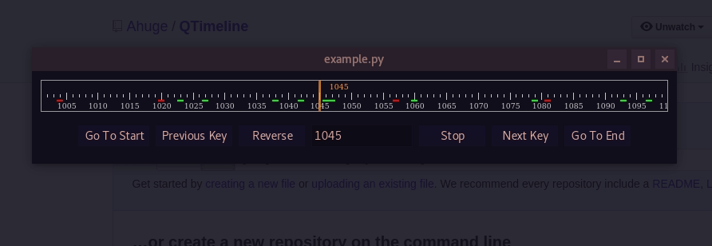

# QTimeline

QTimeline is a collection of Qt Widgets that draw a timeline similar to one you may find in common editorial software.

It does not implement much by itself. It has the concept of a keyframe and an errored frame however on their own, those don't mean much other than a coloured mark on the timeline.

## Timeline.py

This contains our main class, the TimelineWidget.

## Timeline_controller.py

This contains our TimelineButtons class and our TimelineContiner class

### TimelineButtons

This is a few buttons and their associated signals/slots that you may want to display with your TimelineWidget

### TimelineContainer

This class acts mostly like a `Controller` linking the `TimelineButtons` and `TimelineWidget.
It also has minimal support for a playback loop via a QTimer at 30fps.

## Example

